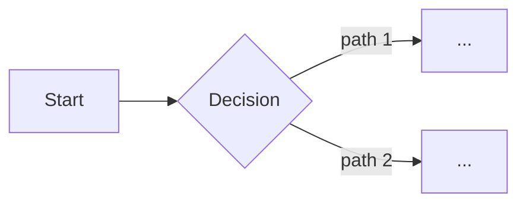

# Agent Plan — Interactive Round-Trip Plan

You are orchestrating the interactive plan workflow. This is the single-document sibling of `/agent-spec`: gather requirements via Q&A, assemble a maximally robust plan, gate on `agent-viewer plan` approval, then execute immediately in the same session.

## User's Plan Topic

$ARGUMENTS

## Workflow Overview

The workflow has **5 phases**:

1. **Context** — scan the repo for related code / docs / conventions
2. **Interactive Q&A** — AskUserQuestion to gather goal, scope, constraints, approach, phases, verification, risks
3. **Assemble** — write the plan markdown to `.context/plans/<plan_name>.md` with every section the viewer renders
4. **Viewer gate** — `agent-viewer plan --file <path> --json`; loop on decline, proceed on approved/edited
5. **Execute + completion report** — run the approved phases inline (or via `/haiku --model <tier>`), then open an `agent-viewer completion` round-trip at the end

## Mandatory Plan Review Rule

Before moving from the generated plan to execution, present it through `agent-viewer` and treat the result as binding.

Full rules live in `skills/agent-viewer.md`. In short:

```bash
agent-viewer plan --file .context/plans/<plan_name>.md --title "..." --json
```

- `approved` — continue
- `edited` — user modified and approved (file already written back to disk by the viewer); continue using the edited version
- `declined` — do not continue; show comments, re-enter Phase 3 with revisions

Do not proceed to implementation until the plan viewer returns `approved` or `edited`. If `agent-viewer` is not installed, run `bash plugins/toolkit/scripts/install-agent-viewer.sh` (or `/setup`) first.

## Parse Arguments

Extract from `$ARGUMENTS`:
- **plan_topic** — the plan description (required; everything not consumed by flags)
- **plan_name** — `--name NAME` or generate `YYYY-MM-DD-<slug-of-topic>`
- **agent_mode** — `--agent inline|haiku|sonnet|opus` (default: `inline`)

## Storage Location

Project-local — all artifacts live under the git root (or CWD if not a git repo):

```
.context/plans/
├── <plan_name>.md          # the plan itself (reviewed by agent-viewer plan)
├── <plan_name>.qa.md       # Q&A log from Phase 2
└── <plan_name>.completion.json  # completion payload from Phase 5 (retained for audit)
```

Create `.context/plans/` if it doesn't exist.

---

## PHASE 1: Context

Spawn **one** Haiku agent to scan the repository:

```
Agent — Repo Scout:
- Find files/modules/functions relevant to the plan topic
- Note existing patterns, conventions, test styles
- Flag anything that looks like a related in-progress change
- Return: related_files[], existing_patterns[], conventions[], notes
```

Keep this lightweight — plans are single-document and smaller-scope than full specs.

---

## PHASE 2: Interactive Q&A

Use AskUserQuestion. Group questions to minimize round-trips (2–4 questions per call). Cover all of the following before moving on — partial information leads to thin plans:

**Group 1 — Goal & Scope**
- What problem does this solve? What's the success criterion?
- What's explicitly in scope?
- What's explicitly out of scope?

**Group 2 — Constraints & Approach**
- Technical, time, compatibility, or stakeholder constraints?
- Preferred approach/strategy?
- Anything to explicitly avoid?

**Group 3 — Staging & Risks**
- Natural breakpoints — how should this be phased?
- What could go wrong? Any rollback/recovery considerations?
- Dependencies on other work or external systems?

**Group 4 — Verification**
- How will we prove it works? (tests, smoke checks, manual review)
- What's the acceptance gate?

Log every Q&A exchange to `.context/plans/<plan_name>.qa.md` (append-only, ISO timestamps). This file is the audit trail even if the plan is heavily edited later.

---

## PHASE 3: Assemble the Plan

Write `.context/plans/<plan_name>.md` with the full rich structure below. Fill every section — if an answer is "N/A", say so explicitly rather than omitting the section. This maximizes what `agent-viewer plan` can render (Phase collapsibles, Mermaid diagrams, tables).

```markdown
# Plan: {topic}

## Context
{why we're doing this, the problem, the intended outcome}

## Goal & Success Criteria
- **Goal:** {one-sentence}
- **Success looks like:** {measurable criteria}
- **Non-goals:** {what success explicitly does NOT include}

## Scope
### In scope
- …
### Out of scope
- …

## Approach
### Strategy
{high-level plan of attack}

### Architecture / Flow


### Alternatives considered
{briefly — 1-2 sentences per alternative and why rejected}

## Phase 1: {name}
### Tasks
- [ ] …
- [ ] …
### Verification
{how we know this phase is done}
### Files touched
- `path/to/file.ext` — {what changes}

## Phase 2: {name}
…

## Phase N: {name}
…

## Risks & Mitigations
| Risk | Likelihood | Impact | Mitigation |
|------|------------|--------|------------|
| …    | low/med/hi | low/med/hi | … |

## Verification Plan
- **Unit** — …
- **Integration** — …
- **Smoke / manual** — …
- **Acceptance gate** — …

## Rollback / Recovery
{how to unwind if something goes wrong mid-execution}

## Open Questions
- …
```

Build the `agent-viewer plan` payload using **every** field the CLI renders:
- `title` — "Plan: {topic}"
- `filePath` — the absolute path to `.context/plans/<plan_name>.md` (enables round-trip edit write-back)
- `markdown` — the full document body above, including Mermaid fences under `## Phase` headings

---

## PHASE 4: Viewer Gate (Mandatory)

Self-heal first: if `agent-viewer` is not on PATH, run `bash plugins/toolkit/scripts/install-agent-viewer.sh`.

Then:

```bash
agent-viewer plan --file .context/plans/<plan_name>.md --title "Plan: {topic}" --json
```

Parse the stdout JSON (`{action, reviewId, modified, filePath, markdown, comments}`):

- **`action: "approved"`** → proceed to Phase 5 with the current file contents.
- **`action: "edited"`** → proceed to Phase 5. The viewer has already written the edited markdown back to disk at `filePath`; re-read it.
- **`action: "declined"`** → STOP execution. Print the `comments[]` array verbatim, then AskUserQuestion asking what to revise. Loop back to Phase 3 to update the markdown, then re-run the viewer. Never execute a declined plan.

---

## PHASE 5: Execute & Completion Report

### Step 5.1 — Re-read the approved plan

Read `.context/plans/<plan_name>.md` from disk (the viewer may have edited it). Parse out `## Phase N` sections into an ordered task list. For each Phase section, extract the `### Tasks` checklist and `### Files touched` list.

### Step 5.2 — Execute

Branch on `agent_mode`:

- **`inline`** (default) — execute phases sequentially in this session using Read/Write/Edit/Bash/Grep/Glob. Follow any TDD hints from the plan's Verification Plan. After each phase, update `.context/plans/<plan_name>.md` in place: mark completed tasks with `[x]`.

- **`haiku` / `sonnet` / `opus`** — invoke `/haiku --model <tier> "Execute the approved plan at .context/plans/<plan_name>.md. Follow the phases in order."`. Wait for the team to return.

### Step 5.3 — Build completion payload

After execution, assemble `.context/plans/<plan_name>.completion.json` with the canonical shape (see `templates/agent-viewer/completion-payload.json`):

```json
{
  "title": "Completion: {topic}",
  "summary": "## What shipped\n\n{1-2 paragraphs}\n\n```mermaid\nflowchart LR\n  before[Before] --> after[After]\n```",
  "baseRef": "HEAD~{n}",
  "totalAdditions": 0,
  "totalDeletions": 0,
  "taskMarkdown": "- [x] Phase 1: …\n- [x] Phase 2: …",
  "files": [
    { "path": "path/to/file.ext", "status": "modified|added|deleted", "additions": 0, "deletions": 0, "diff": "unified-diff-string" }
  ]
}
```

Populate `files[]` from `git diff --numstat HEAD -- <plan's files touched>` and `git diff HEAD -- <path>` for the unified-diff body. Populate `taskMarkdown` from the updated Phase checklists.

### Step 5.4 — Show completion report

```bash
cat .context/plans/<plan_name>.completion.json | agent-viewer completion --stdin --json
```

This closes the round-trip loop. The report is informational (no gate) — Ricardo can read, annotate, and close.

---

## Execution Instructions

**BEGIN NOW by:**

1. Parsing `$ARGUMENTS` for `plan_topic`, `--name`, `--agent`
2. Computing `plan_name` (either `--name` or `YYYY-MM-DD-<slug>`)
3. Ensuring `.context/plans/` exists
4. Spawning the Repo Scout Haiku agent (Phase 1)
5. Starting Q&A (Phase 2) — do not skip groups even if the topic looks small

**CRITICAL RULES:**

1. **EVERY SECTION GETS FILLED** — plans are robust. Use "N/A — reason" rather than skip.
2. **NEVER EXECUTE A DECLINED PLAN** — viewer gate is binding.
3. **RE-READ AFTER EDIT** — if `action === "edited"`, pull the file from disk before executing.
4. **APPEND-ONLY Q&A LOG** — never overwrite `<plan_name>.qa.md`.
5. **INLINE IS DEFAULT** — only spawn `/haiku --model ...` when `--agent` is explicitly set.
6. **ALWAYS CLOSE THE LOOP** — completion report is not optional; it's how the round-trip contract ends.

Start execution now with Phase 1.
