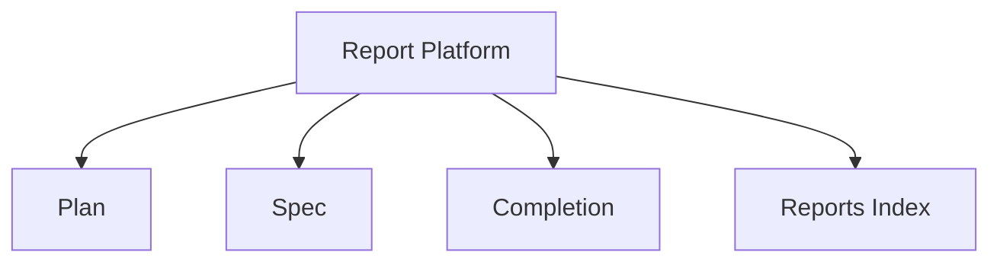

# Requirements: agent-viewer Report Platform v2

## Introduction

The report platform should support interactive and standalone review across plans, specs, completion reports, and persisted report indexes.

## Requirements

### Requirement 1: Unified Contract
1. WHEN any report is passed into the CLI THEN the system SHALL identify its report family and normalize its payload.
2. IF a report type supports markdown THEN the system SHALL support Mermaid diagrams inside markdown code fences.
3. WHEN a report is exported THEN the system SHALL generate a self-contained HTML artifact.

### Requirement 2: Iterative Review
1. WHEN a user edits a live artifact THEN the system SHALL persist the reviewed content back to disk or structured result output.
2. IF a report is not approved THEN the system SHALL support another review round.
