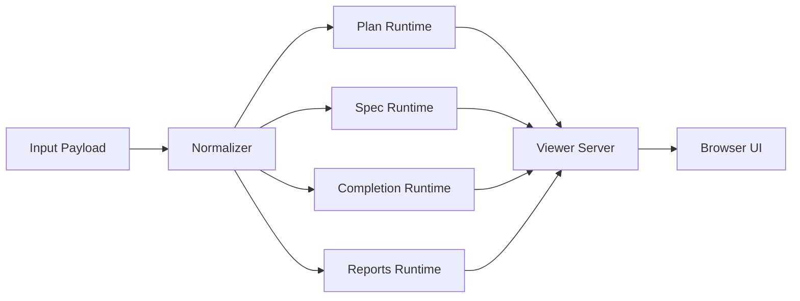

# Design: Shared Runtime and Report-Specific Renderers

## Architecture Overview

## Design Notes

- Shared runtime should handle argument parsing, server lifecycle, browser launch, and JSON result emission.
- Report-specific renderers should own layout and interaction details.
- Standalone export should reuse the same report-family structure wherever possible.
